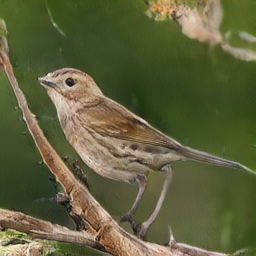
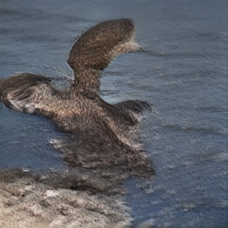

# GAN You Feel the Love Tonight

This repository contains materials related to the semester-long project for CMPE 255 (Data Mining).

## Team

* Brian Ho ([hobriandh](https://github.com/hobriandh))
* Chinmay Kamerkar ([mercury297](https://github.com/mercury297))
* Pratik Kasle ([PRKKILLER](https://github.com/PRKKILLER))
* Andrew Selvia ([AndrewSelviaSJSU](https://github.com/AndrewSelviaSJSU))

## Presentation

We presented the core principles of GANs to the class on March 9th. You can review our presentation in either its original [Keynote format](Presentation.key) or [PDF format](Presentation.pdf). Since we were the first to present, we had not had time to implement any of our ideas, thus this report presents details about our implementation strategies.

## Abstract

Our research focuses on *Generative Adversarial Networks* (GANs). We chose to divide the work so we could explore two unique applications of GANs. This way, we could compare and contrast the efficacy of different architectures and approaches. Andrew and Brian chose to focus on training a GAN to generate pictures from text; in other words, text-to-image. Chinmay and Pratik chose to focus on...

## Text-to-image

### Approach

Text-to-image applications present an immediate opportunity for GANs to demonstrate their value. Creative fields such as graphic design, architecture, and video editing are obvious candidates for early option. One can imagine an architect being able to ideate designs far more quickly, potentially even in real-time with their clients. Business models may also evolve due to this research; for instance, property owners equipped with smartphones could potentially use a generative model to independently explore renovation ideas without the direct assistance of a trained architect.

[Various papers and projects exploring this space](https://paperswithcode.com/task/text-to-image-generation) were researched to provide a basic understanding of the state-of-the-art. Andrew chose to use [StackGAN-v2](https://github.com/hanzhanggit/StackGAN-v2) (based on [the StackGAN++ paper](https://arxiv.org/abs/1710.10916)) as a baseline due to its foundation on PyTorch which has seen been growing in popularity in research circles. Obviously, the project was not ready for use right off the shelf; specifically, it required modifications and modernization to run properly on the SJSU High Performance Computing (HPC) system. You can browse all the changes required to get the project working on the HPC on [the cmpe255 branch of Andrew's fork of StackGAN-v2](https://github.com/AndrewSelviaSJSU/StackGAN-v2/tree/cmpe255). If you would like to run StackGAN-v2 on the HPC yourself, follow [these instructions](https://github.com/AndrewSelviaSJSU/StackGAN-v2/blob/cmpe255/cmpe255.md).

Quickly, let us establish the importance of the HPC. We need to store hundreds of gigabytes of image data and train multiple deep neural networks (GANs train both a generator and discriminator). The latter is an especially taxing task without the aid of at least one GPU. The HPC provides us with both the disk space and GPU nodes necessary to accomplish our research. More importantly, given the fact that we're students, it's free (unlike if we were forced to use an external cloud platform). Thus, for speed of iteration, it was critical for us to adapt our work for the SJSU HPC.

### Results

After training StackGAN-v2 on [the Caltech-UCSD birds data set](http://www.vision.caltech.edu/visipedia/CUB-200-2011.html), Andrew was able to generate thousands of novel images including those selected below.

First, observe this fairly believable sample for the input text: "medium sized bird with a stout beak and brown and white feathers." Here, the model demonstrates its ability to comprehend the size and color explicitly defined in the text. Interestingly, it has also learned to place the bird in a believable scene, perched on a branch; though, the angle and length of the legs seem slightly off. Whether the blur applied to the background is a lesson learned from bokeh-style photographs in the training dataset or simply a clever trick learned by the generator to bypass the discriminator is unclear.

Next, let us consider the result for this sentence: "this bird has a long brown bill and is brown all over." Obviously, the generated image bears some resemblance to a duck floating in water. However, its warped and distorted proportions ruin the effect. Interestingly, the generator appears to have made an attempt to create a reflection in the water; no doubt due to the presence of reflections in the training data set. Compared to the first sample, this one seems more likely to fail judgment by humans. 

### Conclusion

Despite some impressive results, this project illuminated the challenges GANs continue to face in exploring the vast search spaces involved in the text-to-image problem. It also informed how GANs have evolved since their introduction in 2014. In 7 years, researchers have propelled GANs from their origin generating randomized black-and-white images in a given search space. Now, state-of-the-art GAN research is capable of producing color images indiscernible from real ones. New frontiers such as text-to-image GAN research are exploring the ability to guide the output of GANs (rather than simply employing them to produce randomized samples). It is our responsibility to lead this nascent field forward responsibly.

In the future, we plan to explore even more state-of-the-art GAN research. In particular, [this speech-to-image paper](https://arxiv.org/pdf/2004.03413.pdf) from last year seems promising. One can imagine many real-time applications where speech is a more natural input than text.

### References

* [Google: Introduction to GANs](https://developers.google.com/machine-learning/gan)
* [StackGAN++: Realistic Image Synthesis with Stacked Generative Adversarial Networks](https://arxiv.org/abs/1710.10916)
* [AttnGAN: Fine-Grained Text to Image Generation with Attentional Generative Adversarial Networks](https://arxiv.org/abs/1711.10485)
* [Direct Speech-to-image Translation](https://arxiv.org/abs/2004.03413)

## TODO: Chinmay & Pratik
### Face Aging using GANs

### Approach
Face aging, also known as age synthesis and age progression, is defined as aesthetically rendering a face image with natural aging and rejuvenating effects on the individual face. It has plenty of applications in various domains including cross-age face recognition, finding lost children
and entertainment. The presented traditional face aging approaches are limited to modeling of the aging patterns missing the global comprehension of a human face (its personality traits, facial expression, possible facial accessories etc.) However, in many real-life use cases, face aging must be combined with other
face alterations, such as adding sunglasses or beard. These non-trivial modifications require global generative models of
human faces. Natural image generation has been thoroughly studied for years, but it has not been until 2014 when advances in deep learning has allowed to produce image samples and interpolations of very high visual fidelity.

### Notable papers exploring this space.
[1. Wang_Face_Aging_With_CVPR_2018_paper](https://openaccess.thecvf.com/content_cvpr_2018/papers/Wang_Face_Aging_With_CVPR_2018_paper.pdf)

[2. Face Aging With Conditional Generative Adversarial Networks](https://arxiv.org/pdf/1702.01983.pdf)

### Results

### Conclusion
